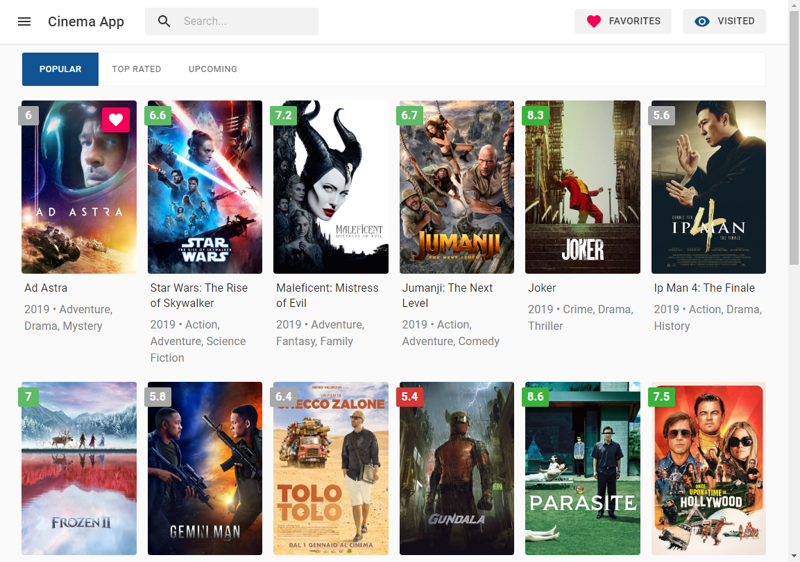

# Movie Library Application (React / Redux)
A simple and fast application that allows you to discover movies. Fully written with *React Hooks* and *Material UI* library.

Powered by [The Movie Database API](https://developers.themoviedb.org/3/getting-started/introduction).

# Demo
The app is hosted on Heroku. [**TRY IT IN ACTION!**](https://react-cinema.herokuapp.com/)



# Features
The application allows to:
- Search movies
- Get movie info
- Get similar movies
- Get recommended movies
- Discover popular/trending/upcoming movies
- Add to favorites
- Watch visited movies 

# Tech Features
- [x] Material UI
- [x] React Hooks
- [x] Redux implementation 
- [x] Custom Redux Middleware
- [x] Async Requests
- [x] Action Cancellation
- [x] Debouncing
- [x] Lazy Loading
- [x] Dynamic Loading
- [x] Client-Side Storage

# Todo ✔️
- [ ] Improve responsiveness
- [ ] Add routes for tabs on the Home page
- [ ] Refactor code

# Development 💻
This app is created by using create-react-app. 
So you can simply install the dependencies:
```bash
$ npm i
```
And then start the development server:
```bash
$ npm run start 
```

# License 
MIT
